

  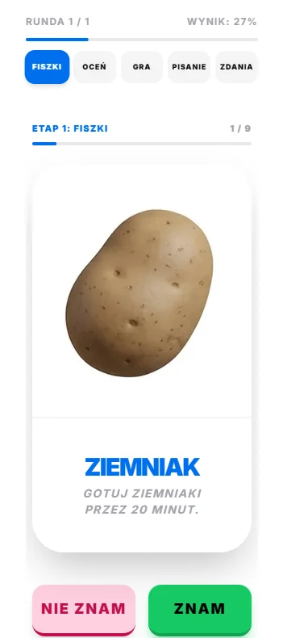
  <h1>🚀 EL APP - Twój Interaktywny Nauczyciel Angielskiego</h1>
  
<b>Nowoczesna nauka języka angielskiego oparta na etapach i wizualnych skojarzeniach.</b>

  **🔗 [🔴 Zobacz Demo na żywo / Live Demo (Kliknij tutaj)](https://sevetoo.github.io/el-app) 🔗**

---

## 📖 Spis Treści
- [🛠️ Stack Technologiczny](#️-stack-technologiczny)
- [✨ Pierwsze Wrażenie (Loader)](#-pierwsze-wrażenie-loader)
- [✨ Etapy Nauki (Learning Flow)](#-etapy-nauki-learning-flow)
- [🧠 Inteligentna Pętla Nauki (Study Loop)](#-inteligentna-pętla-nauki-study-loop)
- [📈 Wydajność i Optymalizacja (98%+)](#-wydajność-i-optymalizacja-98)
- [🌓 Dark Mode & UI Showcase](#-dark-mode--ui-showcase)
- [🛠️ Wyzwania Techniczne](#-wyzwania-techniczne-deep-dive)
- [🎨 Prototypowanie UI](#-prototypowanie-ui-design-exploration)
- [🚀 Jak uruchomić to samemu](#-jak-uruchomić-to-samemu)
- [🗺️ Plany Rozwoju (Roadmap)](#-plany-rozwoju-roadmap)

---

## 🛠️ Stack Technologiczny

Aplikacja została zbudowana w oparciu o najnowocześniejszy stack webowy, zapewniający szybkość, dostępność i responsywność:

  

- **Framework**: [Next.js 15](https://nextjs.org/) (App Router, Server Components)
- **Styling**: [TailwindCSS](https://tailwindcss.com/) & [HeroUI](https://heroui.com/)
- **Animations**: [Framer Motion](https://www.framer.com/motion/)
- **Audio**: Web Speech API (Native Text-to-Speech)
- **Deployment**: GitHub Pages (Static Export)

---

## ✨ Pierwsze Wrażenie (Loader)

Zamiast pustej strony, użytkownik widzi autorsko zaprojektowany ekran ładowania, który przygotowuje silnik nauki:

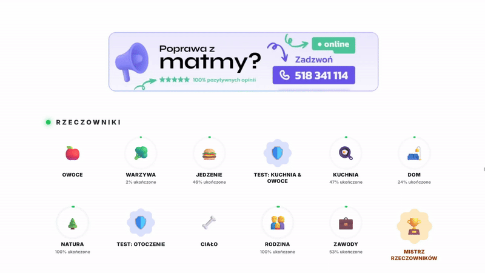

*   **Animowane Logo**: Pulsujące i obracające się logo **EL APP**.
*   **Adaptacyjność**: Loader automatycznie wykrywa motyw przeglądarki użytkownika.

---

## ✨ Etapy Nauki (Learning Flow)

Aplikacja prowadzi użytkownika przez 5 inteligentnych etapów nauki, od poznania słowa do jego swobodnego użycia w zdaniu:

1.  **🗂️ Etap 1: Fiszki (Flashcards)**
    - 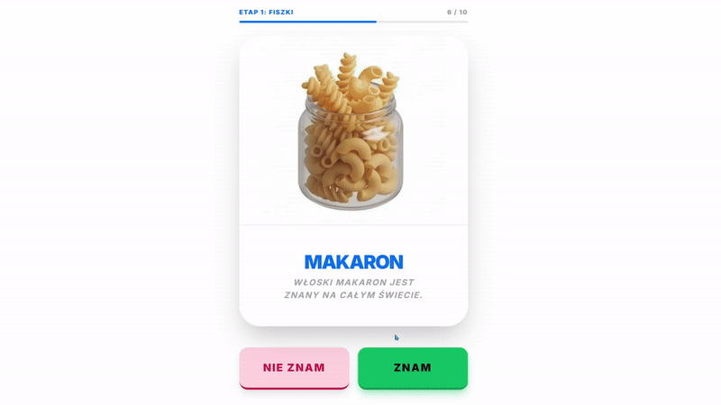
2.  **⚖️ Etap 2: Szybka Ocena (Fast Review)**
    - 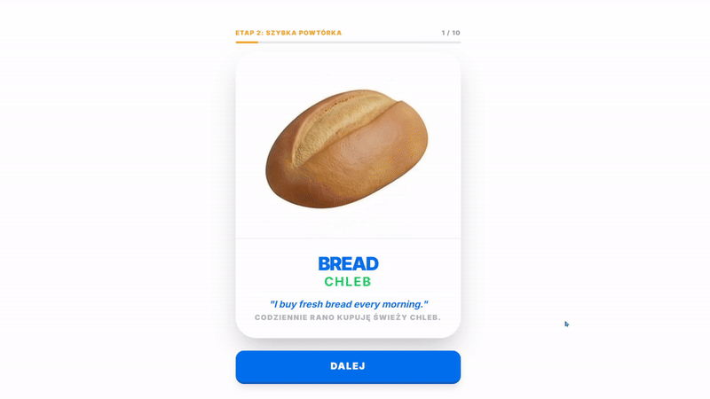
3.  **🎮 Etap 3: Gra w Dopasowywanie (Matching Game)**
    - 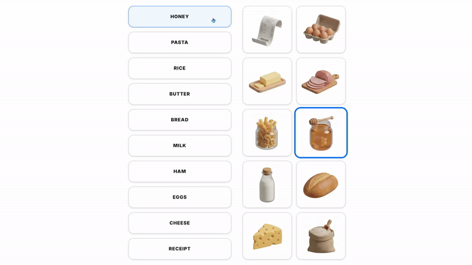
4.  **✍️ Etap 4: Test Pisemny (Written Test)**
    - 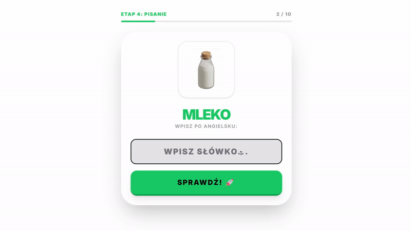
5.  **📝 Etap 5: Uzupełnianie Zdań (Sentences)**
    - 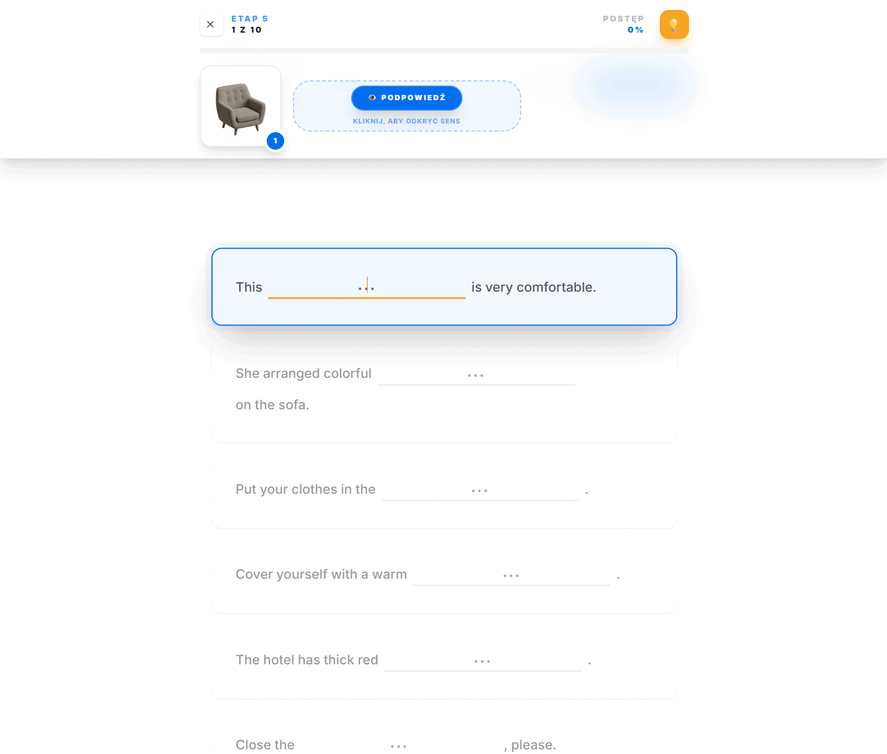

---

## 🧠 Inteligentna Pętla Nauki (Study Loop)

Sercem aplikacji jest algorytm zarządzający postępem użytkownika:
- **Grupy po 10 słówek**: Nauka podzielona na strawne partie, aby uniknąć zmęczenia.
- **System Błędów**: Słówka sprawiające trudność automatycznie trafiają do powtórek w kolejnej rundzie.
- **Lokalny Zapis (Local Storage)**: Twój postęp jest bezpieczny nawet po odświeżeniu strony czy zamknięciu przeglądarki.

---

## 📈 Wydajność i Optymalizacja (98%+)

Projekt osiąga najwyższe noty w audytach Lighthouse dzięki optymalizacji obrazów WebP i nowoczesnemu ładowaniu zasobów:

| Wynik Lighthouse (Mobile) | Wynik Lighthouse (Desktop) |
| :---: | :---: |
| 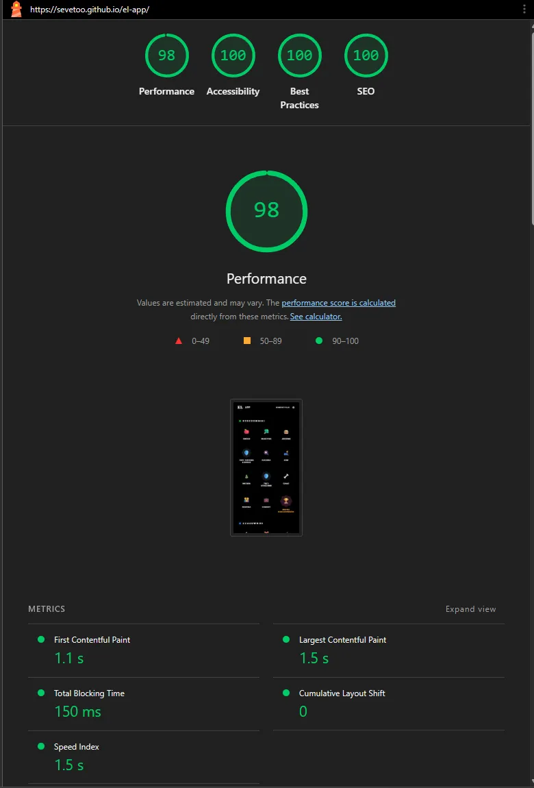 | 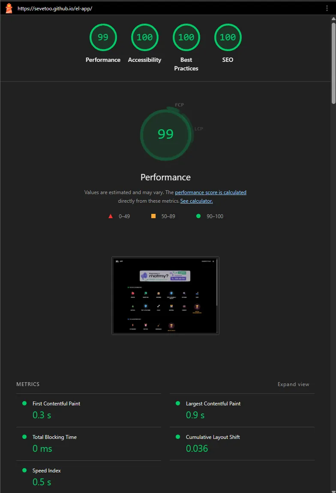 |

---

## 🌓 Dark Mode & UI Showcase

Pełne wsparcie dla motywów jasnych i ciemnych z responsywnym układem:

| Wariant | Desktop | Mobile |
| :--- | :---: | :---: |
| ☀️ **Tryb Jasny** | 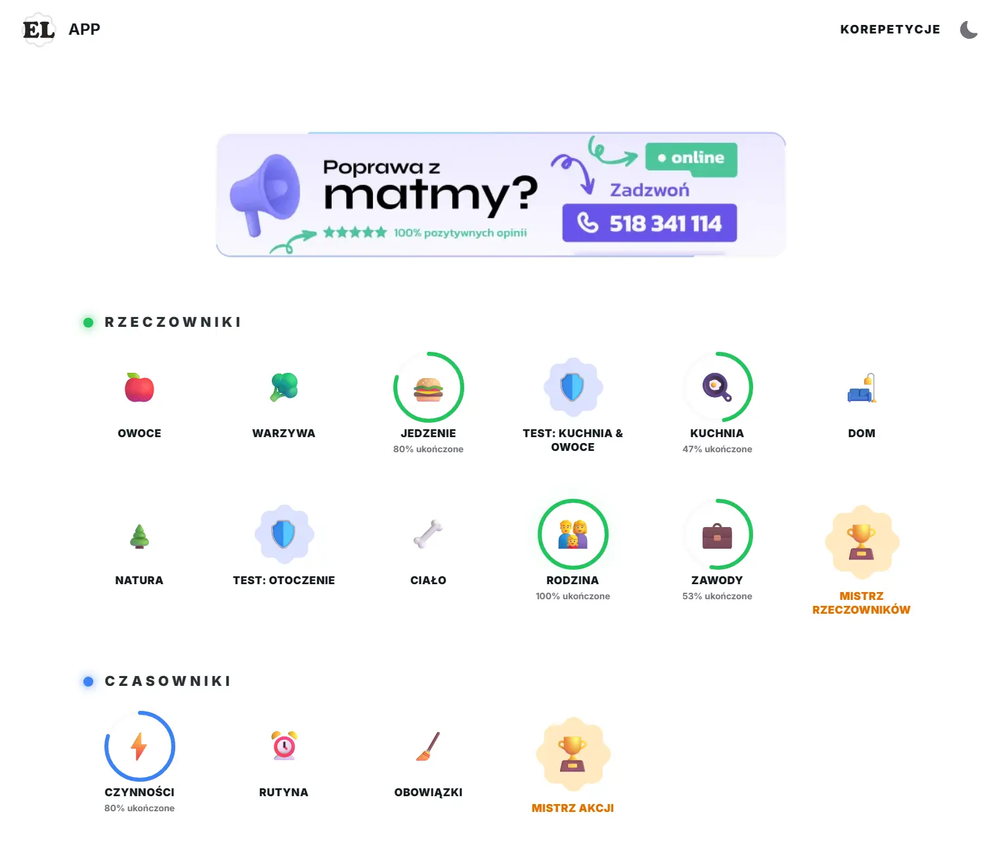 | 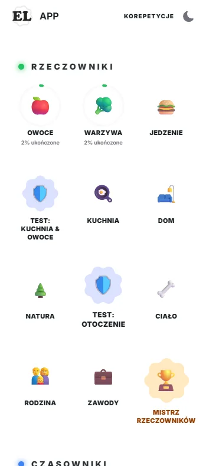 |
| 🌙 **Tryb Ciemny** | 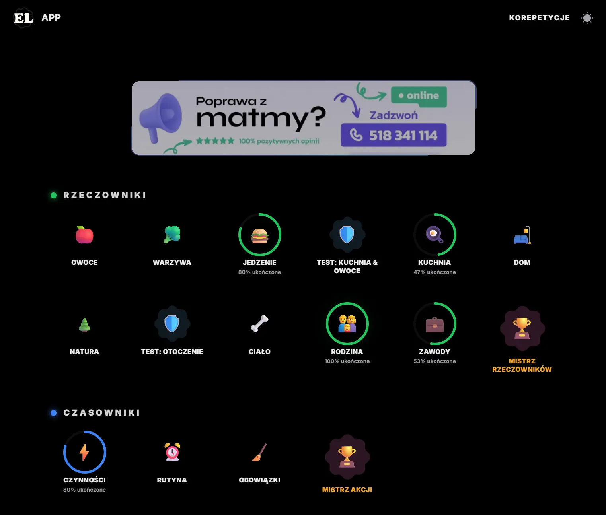 | 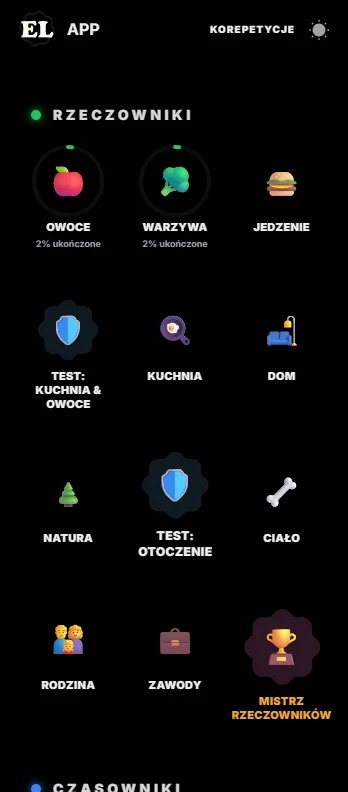 |

### 📱 Podgląd Mobilny (Stage Screenshots)
| Etap 1 | Etap 2 | Etap 3 | Etap 4 | Etap 5 |
| :---: | :---: | :---: | :---: | :---: |
|  | 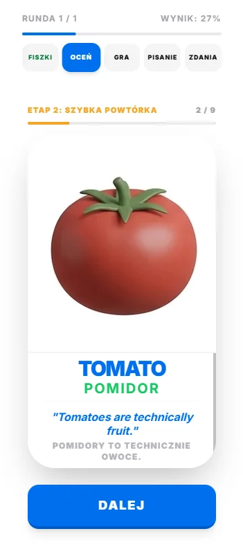 | 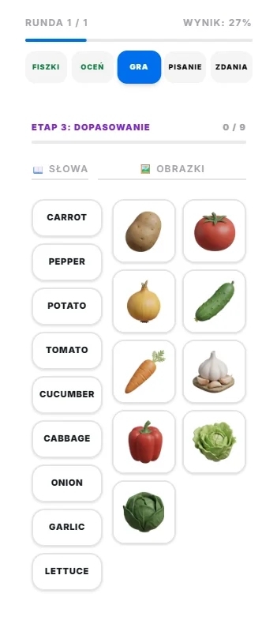 | 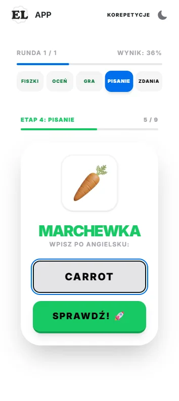 | 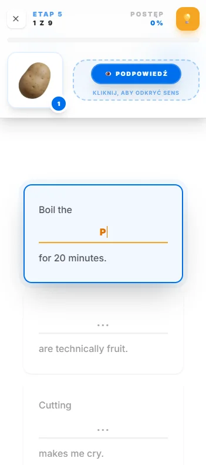 |

---

## 🛠️ Wyzwania Techniczne (Deep Dive)

Projektowanie na darmowe hostingi statyczne (GitHub Pages) wymagało kreatywnych rozwiązań:

- **Hydracja & Statyczny Eksport**: Wdrożenie `trailingSlash: true` wyeliminowało błędy routingu oraz błędy **#418 (Hydration Failed)**.
- **Visual Viewport API**: Dynamiczne obliczanie położenia nagłówka nad klawiaturą mobilną (`window.visualViewport.offsetTop`) zapewnia idealne UI podczas pisania.
- **PWA w Sub-katalogu**: System dynamicznych metadanych wstrzykuje poprawny `basePath` do manifestu, umożliwiając instalację jako PWA bezpośrednio z GitHub Pages.

---

## 🎨 Prototypowanie UI (Design Exploration)

Aplikacja stale ewoluuje. W ramach prac nad nowym menu głównym, stworzyliśmy stronę z prototypami dostępną pod `/design-preview`. Testujemy tam koncepcje takie jak:
- **Galaxy Cards** (Karty Galaktyki)
- **Quest Path** (Ścieżka Zadań)
- **Compact List** (Kompaktowa Lista)

---

## 🚀 Jak uruchomić to samemu

1. Zainstaluj biblioteki: `npm install`
2. Uruchom dewelopersko: `npm run dev`
3. Buduj statycznie: `npm run build` (wynik w folderze `/out`)

---

## 🎨 Obrazy (Assets)

Obrazki użyte w aplikacji zostały wygenerowane za pomocą modelu **Nano Banana 2** (Gemini 3 Flash Image). Każdy z nich został zoptymalizowany do formatu `.webp`, aby zapewnić błyskawiczne ładowanie.

---

## 🗺️ Plany Rozwoju (Roadmap)

- **🎮 Mini-gry (Gamification)**: Snajper, Zgadnij Kto To, Misja Zakupy, Kreator Sceny.
- **🎙️ Tryb Dyktowania**: Zapisywanie usłyszanych zdań.
- **🎧 Rozumienie ze Słuchu**: Zaawansowane ćwiczenia audio.
- **☁️ Cloud Sync**: Synchronizacja statystyk w chmurze.

---

_Stworzone z pasją do nauki języków by [SeveToo](https://github.com/SeveToo)_
