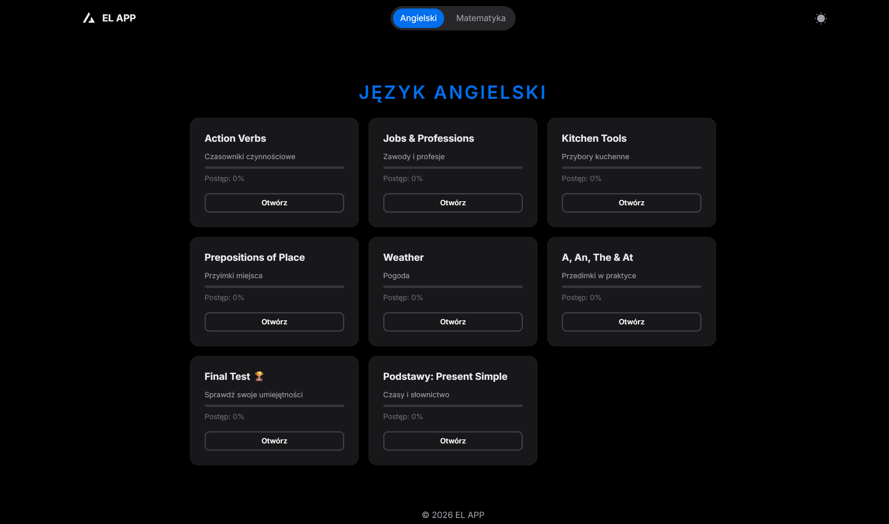
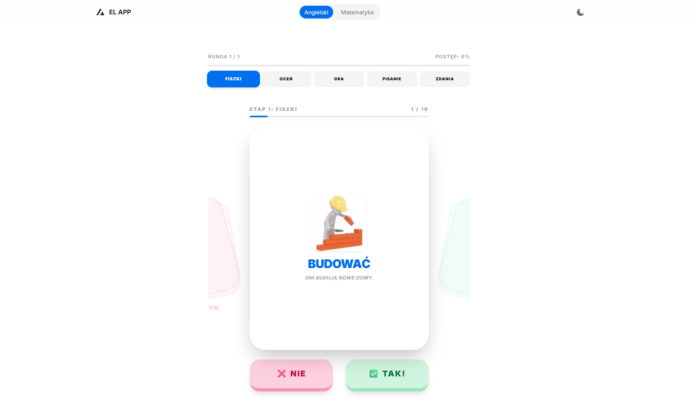
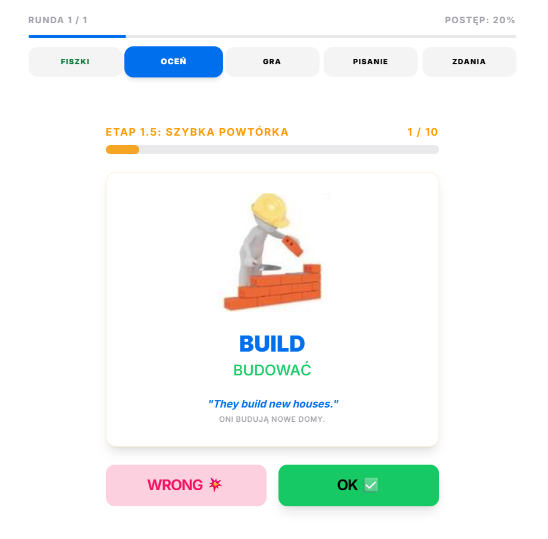
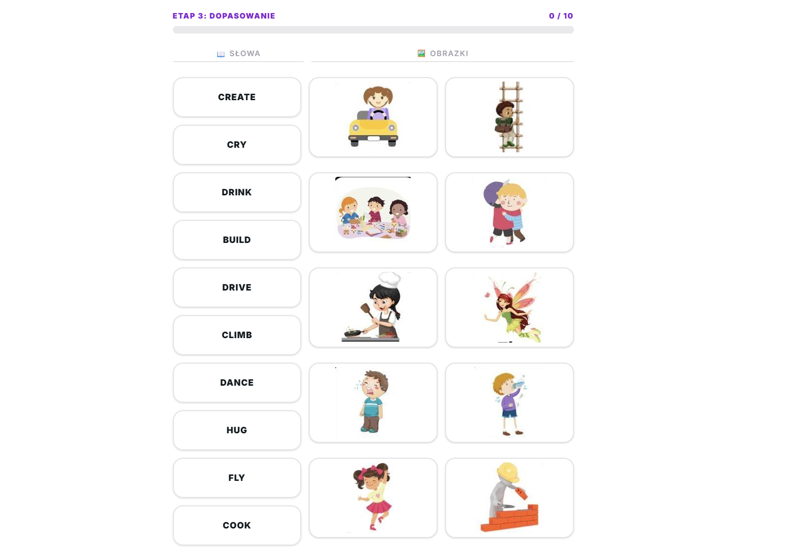
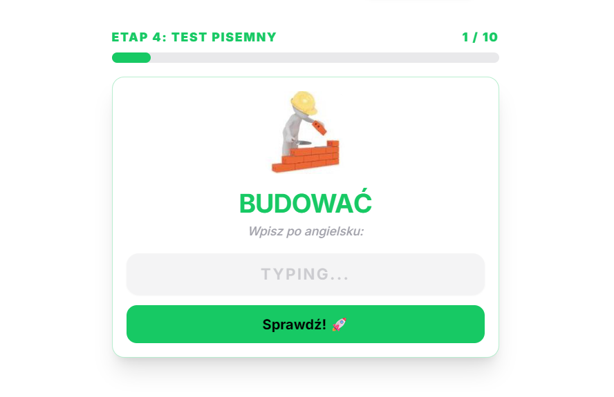
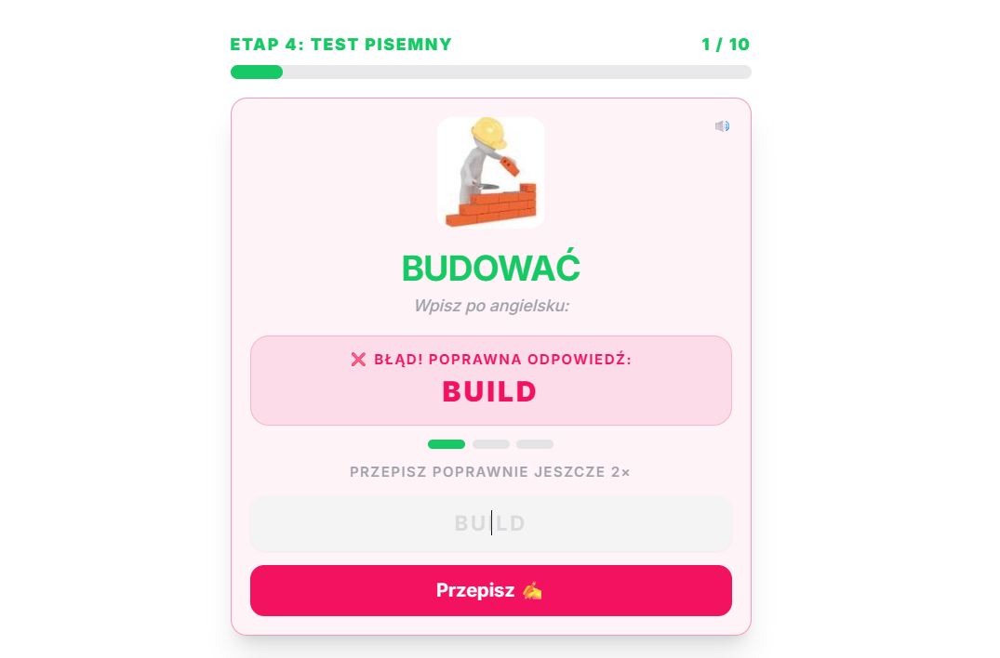
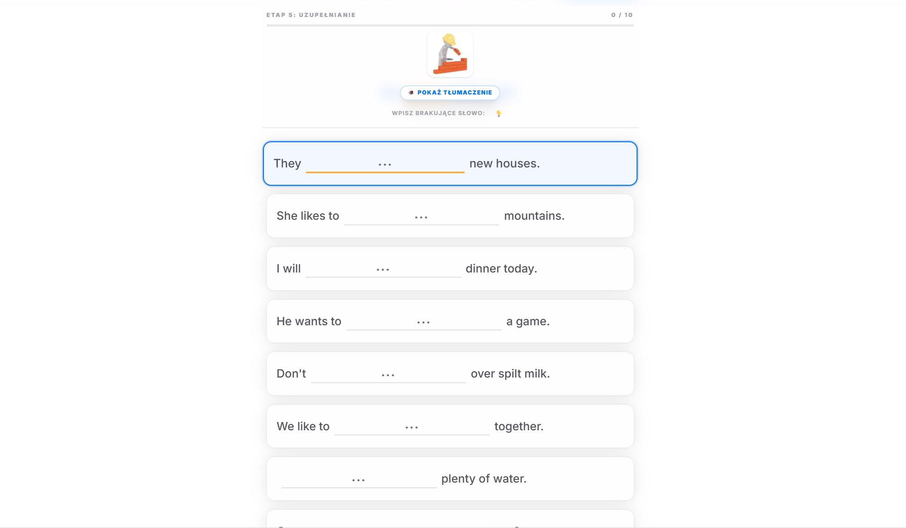
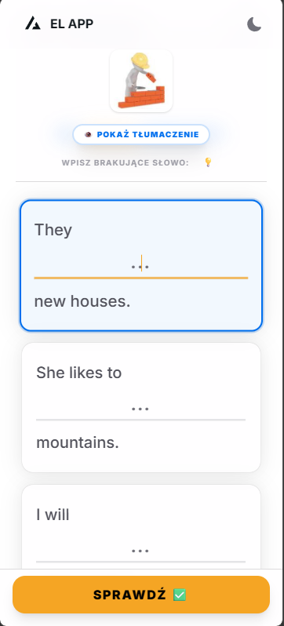

# 🚀 EL APP - Twój Interaktywny Nauczyciel Angielskiego

**EL APP** to nowoczesna aplikacja webowa do nauki języka angielskiego, zaprojektowana z myślą o maksymalnej efektywności i przyjemności z nauki. System oparty na etapach (Stages) pozwala na płynne przejście od poznania słowa do jego swobodnego użycia w kontekście.

---

## ✨ Etapy Nauki (Learning Flow)

Aplikacja prowadzi użytkownika przez 5 inteligentnych etapów nauki:

1.  **🗂️ Etap 1: Fiszki (Flashcards)**
    *   Dynamiczne karty z obrazkami i przykładami.
    *   Pełna wymowa audio (native speaker).
    *   

2.  **⚖️ Etap 1.5: Szybka Ocena (Fast Review)**
    *   Błyskawiczna weryfikacja znajomości słówek.
    *   

3.  **🎮 Etap 3: Gra w Dopasowywanie (Matching Game)**
    *   Dopasuj angielskie słowo do odpowiedniego obrazka. Trening skojarzeń wizualnych.
    *   

4.  **✍️ Etap 4: Test Pisemny (Written Test)**
    *   Wpisywanie słówek z pamięci z **Trybem Karnym** za błędy.
    *   
    *   *Tryb karny przy błędzie:*
    *   

5.  **📝 Etap 5: Uzupełnianie Zdań (Sentences)**
    *   Użycie słowa w prawdziwym kontekście z systemem inteligentnych podpowiedzi (💡).
    *   

---

## 📱 Responsywność (Mobile-First)

Aplikacja posiada dedykowane mechanizmy dla smartfonów:
*   **Adaptacyjny Interfejs:** Wykrywanie klawiatury ekranowej, ukrywanie zbędnych elementów i dynamiczne pozycjonowanie.
*   

### 💡 Wyzwanie Techniczne: Klawiatura na Mobile
Standardowe pozycjonowanie `sticky` lub `fixed` często zawodzi na urządzeniach mobilnych, gdy użytkownik otwiera klawiaturę wirtualną — obrazek i kluczowe elementy często znikały "pod palcami" lub uciekały poza widoczny obszar.

**Rozwiązanie:** 
Zastosowałem **Visual Viewport API** (`window.visualViewport.offsetTop`), które dynamicznie oblicza rzeczywiste położenie górnej krawędzi widocznego okna (nad klawiaturą). Dzięki temu nagłówki w Etapie 5 są zawsze idealnie przyklejone do góry widocznego obszaru, eliminując potrzebę zbędnego przewijania. Rozwiązanie to działa wybitnie płynnie na nowoczesnych smartfonach! 🦾📱

---

## 🧠 Inteligentna Pętla Nauki (Study Loop)

*   **Grupy po 10 słówek:** Nauka podzielona na strawne partie.
*   **System Błędów:** Słówka sprawiające trudność automatycznie trafiają do powtórek w kolejnej rundzie.
*   **Lokalny Zapis (Local Storage):** Twój postęp jest bezpieczny nawet po odświeżeniu strony.

---

## 🎨 Obrazy (Assets)

Obrazki użyte w aplikacji zostały wygenerowane za pomocą **Gemini Nanobanana**. Każdy z nich został zoptymalizowany do formatu `.webp`, aby zapewnić błyskawiczne ładowanie.

---

## 🛠️ Stack Technologiczny

- **Framework**: [Next.js 15](https://nextjs.org/) (App Router, App Context)
- **Styling**: [TailwindCSS](https://tailwindcss.com/)
- **UI Components**: [HeroUI](https://heroui.com/) (Modern, Accessible components)
- **Animations**: [Framer Motion](https://www.framer.com/motion/)
- **Audio**: Web Speech API (Native TTS)
- **Deployment**: GitHub Pages (via GitHub Actions)

---

## 🗺️ Plany Rozwoju (Roadmap)

*   **🎙️ Tryb Dyktowania:** Słuchasz całych zdań i musisz je zapisać bezbłędnie.
*   **🎧 Rozumienie ze Słuchu:** Zaawansowane ćwiczenia audio z wyborem opcji.
*   **🏙️ Tryb "Miasto" (Visual Context):** Interaktywna mapa miasta do nauki przyimków miejsca i kierunków.
*   **☁️ Cloud Sync:** Konta użytkowników i synchronizacja statystyk.

---

*Stworzone z pasją do nauki języków. by [SeveToo](https://github.com/SeveToo)*
